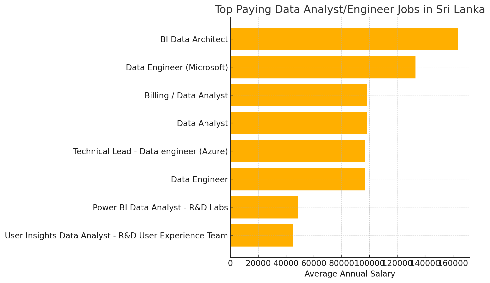
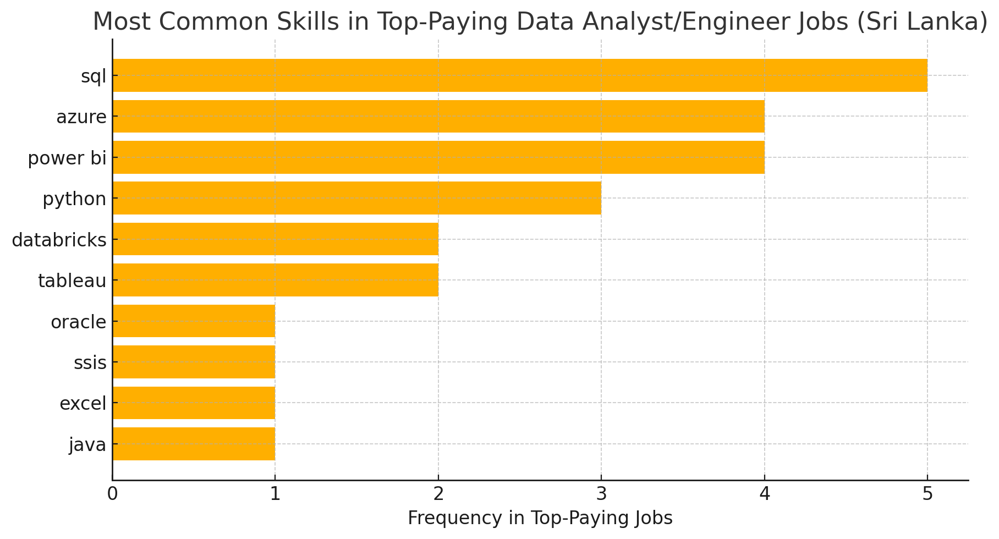
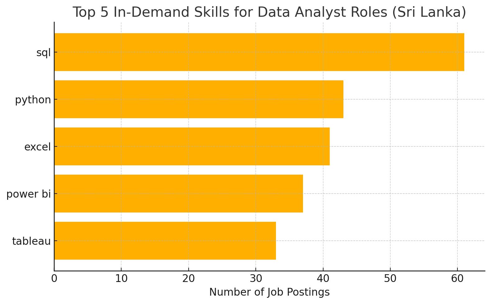
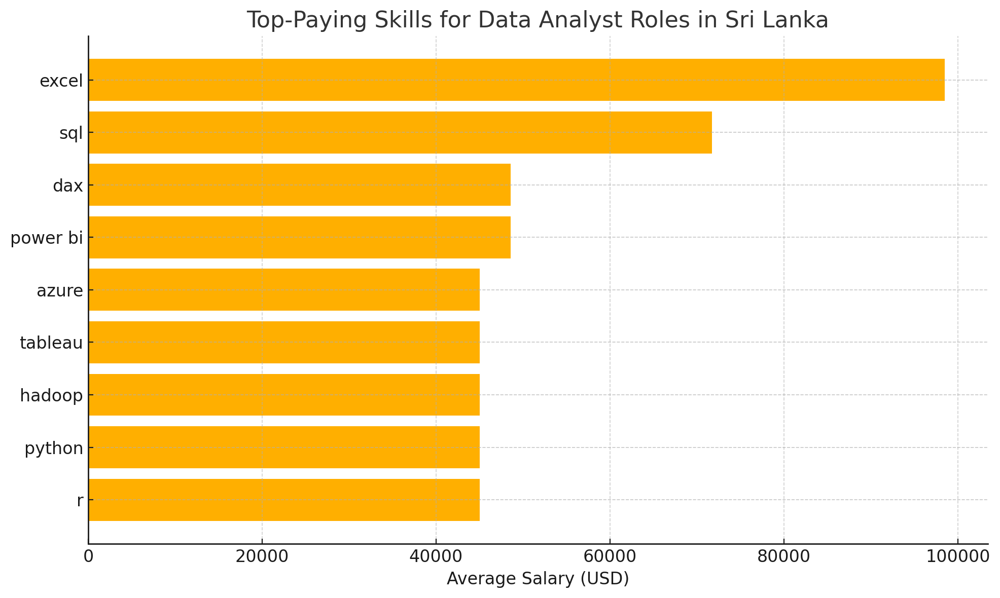

# Introduction
This project provides a comprehensive analysis of data analyst/Engineer roles in Sri Lanka and around the world, focusing on top-paying positions, high-demand skills, and the intersection where skill demand aligns with higher salaries. Using real-world job posting data and structured SQL queries (available in the [project_sql folder](/project_sql/)), the study offers valuable insights into current trends shaping the data analytics job market.

### The questions I wanted to answer through my SQL queries were:
- What are the top-paying data analyst/engineer jobs?
- What skills are required for these top-paying jobs?
- What skills are most in demand for data analysts?
- Which skills are associated with higher salaries?
- What are the most optimal skills to learn?

## Tools and Technologies Used

- **SQL** was used as the core tool for querying the database and extracting key insights from the job posting data.

- **PostgreSQL** served as the database management system, suitable for handling and managing structured data efficiently.

- **Visual Studio Code** was used to write and execute SQL queries, providing a streamlined environment for development.

- **Git** and **GitHub** were used for version control and collaboration, enabling effective tracking and sharing of SQL scripts and project progress.

## Analysis

### 1. Top Paying Data Analyst/Engineer Jobs in Sri Lanka?
This analysis highlights the top-paying Data Analyst and Data Engineer jobs in Sri Lanka. It shows which roles offer the highest salaries, where they’re located, and what types of positions are most common.

``` sql
SELECT 
    job_id,
    job_title,
    job_location,
    job_schedule_type,
    salary_year_avg,
    job_posted_date,
    name AS Company_Name
FROM
    job_postings_fact
LEFT JOIN company_dim ON job_postings_fact.company_id = company_dim.company_id
WHERE
    (job_title_short = 'Data Analyst' OR job_title_short = 'Data Engineer') AND
    job_country = 'Sri Lanka' AND
    salary_year_avg IS NOT NULL 
ORDER BY
    salary_year_avg DESC
LIMIT 10;
````
Insights:


*Bar Graph Visualizing insights from the top-paying Data Analyst/Engineer jobs in Sri Lanka. This Graph was generated using ChatGPT based on my SQL query results.*


- BI Data Architect roles offer the highest salaries, showing strong demand for advanced business intelligence expertise.

- Data Engineers, especially those with Microsoft or Azure experience, appear frequently in high-paying positions.

- All roles are based in Colombo and are full-time, reflecting that most top-tier data jobs are centralized in the area.

### 2. Key Skills in Top-Paying Data Analyst and Data Engineer Jobs in Sri Lanka?

This analysis reviews the highest-paying Data Analyst and Data Engineer job listings in Sri Lanka to identify which technical skills are most commonly associated with top salaries. By examining required skills in these roles, we can see which technologies and platforms are most valued in the local job market.

``` sql 
WITH top_paying_jobs AS (
    SELECT 
        job_id,
        job_title,
        salary_year_avg,
        name AS Company_Name
    FROM
        job_postings_fact
    LEFT JOIN company_dim ON job_postings_fact.company_id = company_dim.company_id
    WHERE
        (job_title_short = 'Data Analyst' OR job_title_short = 'Data Engineer') AND
        job_country = 'Sri Lanka' AND
        salary_year_avg IS NOT NULL 
    ORDER BY
        salary_year_avg DESC
    LIMIT 10 
)
SELECT
    top_paying_jobs.*,
    skills
FROM
    top_paying_jobs
INNER JOIN skills_job_dim ON top_paying_jobs.job_id = skills_job_dim.job_id
INNER JOIN skills_dim ON skills_job_dim.skill_id = skills_dim.skill_id
ORDER BY
    salary_year_avg DESC

```

Insights:


*Here’s a visualization showing the most common skills found in top-paying Data Analyst and Data Engineer jobs in Sri Lanka. This bar chart was Generated using ChatGPT based on my Query results.*

- SQL is the most frequently required skill for top-paying jobs, underlining its essential role in data-related careers.

- Power BI, Azure, and Python are also common, showing a strong industry preference for data visualization, cloud computing, and programming expertise.

- Many in-demand skills are part of the Microsoft ecosystem (like Power BI, Azure, SSIS), and advanced tools such as Databricks and Hadoop are also appearing, reflecting the rise of automation and big data in high-paying roles.

### 3. Top In-Demand Skills for Data Analyst Roles in Sri Lanka?

This analysis highlights the most sought-after technical skills for Data Analyst positions in Sri Lanka, based on job posting data.

```sql 
SELECT 
    skills,
    COUNT(skills_job_dim.job_id) AS Demand_Count
FROM
    job_postings_fact
INNER JOIN skills_job_dim ON job_postings_fact.job_id = skills_job_dim.job_id
INNER JOIN skills_dim ON skills_job_dim.skill_id = skills_dim.skill_id
WHERE
    job_title_short = 'Data Analyst' AND
    job_country = 'Sri Lanka'
GROUP BY
    skills
ORDER BY
    Demand_Count DESC
LIMIT 5;
````

Insights:


*This Bar Graph shows the Top In-Demand Skills for Data Analyst Roles in Sri Lanka. This chart was Generated using ChatGPT based on my Query results.*

- SQL is the most in-demand skill, appearing in the highest number of job postings.

- Python and Excel are also highly valued, reflecting their use in data manipulation and reporting.

- Power BI and Tableau follow closely, showing the growing importance of data visualization tools.

### 4. Top-Paying Skills for Data Analyst Roles in Sri Lanka?

This analysis explores which technical skills are associated with higher salaries for Data Analyst roles in Sri Lanka. It uses real job posting data to identify which skills are most financially rewarding.
```sql
SELECT
    skills,
    ROUND(AVG(salary_year_avg),2) AS Average_Salary
FROM
    job_postings_fact
INNER JOIN skills_job_dim ON job_postings_fact.job_id = skills_job_dim.job_id
INNER JOIN skills_dim ON skills_job_dim.skill_id = skills_dim.skill_id
WHERE
    job_title_short = 'Data Analyst' AND
    salary_year_avg IS NOT NULL AND
    job_country = 'Sri Lanka'
GROUP BY 
    skills
ORDER BY
    Average_Salary DESC
LIMIT 25; 
```
Insights:


*Here’s the chart visualizing the average salaries for top-paying data analyst skills in Sri Lanka. This Bar Chart was Generated using Chatgpt based on my Query results.*
- Excel tops the list with the highest average salary, showing its ongoing relevance and value in analytics roles.

- SQL and DAX/Power BI also command strong salaries, reflecting their importance in data querying and business intelligence.

- Skills like Python, R, Hadoop, Azure, and Tableau offer competitive pay, highlighting demand for a blend of programming, big data, and cloud tools.

### 5. Top Remote Data Analyst Skills with High Demand and Salary (Global)?

This analysis reveals the most in-demand and highest-paying technical skills for remote Data Analyst jobs worldwide. It highlights which skills are both commonly requested and offer the best salary potential for remote roles.

```sql
WITH demand_skills AS (  --CTE 1
    SELECT 
        skills_dim.skill_id,
        skills_dim.skills,
        COUNT(skills_job_dim.job_id) AS Demand_Count
    FROM
        job_postings_fact
    INNER JOIN skills_job_dim ON job_postings_fact.job_id = skills_job_dim.job_id
    INNER JOIN skills_dim ON skills_job_dim.skill_id = skills_dim.skill_id
    WHERE
        /*job_title_short = 'Data Analyst' AND
        salary_year_avg IS NOT NULL AND
        job_country = 'Sri Lanka'*/
        job_title_short = 'Data Analyst' AND
        salary_year_avg IS NOT NULL AND
        job_work_from_home = 'True'
    GROUP BY
        skills_dim.skill_id

), Salary AS (  --CTE 2
    SELECT
        skills_dim.skill_id,
        skills_dim.skills,
        ROUND(AVG(salary_year_avg),2) AS Average_Salary
    FROM
        job_postings_fact
    INNER JOIN skills_job_dim ON job_postings_fact.job_id = skills_job_dim.job_id
    INNER JOIN skills_dim ON skills_job_dim.skill_id = skills_dim.skill_id
    WHERE
        /*job_title_short = 'Data Analyst' AND
        salary_year_avg IS NOT NULL AND
        job_country = 'Sri Lanka'*/
        job_title_short = 'Data Analyst' AND
        salary_year_avg IS NOT NULL AND
        job_work_from_home = 'True'
    GROUP BY 
        skills_dim.skill_id
)

SELECT 
    demand_skills.skill_id,
    demand_skills.skills,
    demand_skills.Demand_Count,
    Salary.Average_Salary
FROM
    demand_skills
INNER JOIN Salary ON demand_skills.skill_id = Salary.skill_id
WHERE
    demand_skills.Demand_Count > 10
ORDER BY
    Average_Salary DESC,
    Demand_Count DESC
LIMIT 25;

```
#### Method 2.

```sql 
-- Rewriting the query more concisely

SELECT
    skills_dim.skill_id,
    skills_dim.skills,
    COUNT(skills_job_dim.job_id) AS Demand_Count,
    ROUND(AVG(job_postings_fact.salary_year_avg), 2) AS Average_Salary
FROM 
    job_postings_fact
INNER JOIN skills_job_dim ON job_postings_fact.job_id = skills_job_dim.job_id
INNER JOIN skills_dim ON skills_job_dim.skill_id = skills_dim.skill_id
WHERE
    job_title_short = 'Data Analyst' AND
    salary_year_avg IS NOT NULL AND
    job_work_from_home = 'True'
GROUP BY    
    skills_dim.skill_id
HAVING
    COUNT(skills_job_dim.job_id) > 10
ORDER BY
    Average_Salary DESC,
    Demand_Count DESC
LIMIT 25;
```

Insights:

| Skill ID | Skill       | Demand Count | Average Salary (USD) |
|----------|-------------|--------------|----------------------|
| 8        | go          | 27           | 115,319.89           |
| 234      | confluence  | 11           | 114,209.91           |
| 97       | hadoop      | 22           | 113,192.57           |
| 80       | snowflake   | 37           | 112,947.97           |
| 74       | azure       | 34           | 111,225.10           |
| 77       | bigquery    | 13           | 109,653.85           |
| 76       | aws         | 32           | 108,317.30           |
| 4        | java        | 17           | 106,906.44           |
| 194      | ssis        | 12           | 106,683.33           |
| 233      | jira        | 20           | 104,917.90           |
| 79       | oracle      | 37           | 104,533.70           |
| 185      | looker      | 49           | 103,795.30           |
| 2        | nosql       | 13           | 101,413.73           |
| 1        | python      | 236          | 101,397.22           |
| 5        | r           | 148          | 100,498.77           |
| 78       | redshift    | 16           | 99,936.44            |
| 187      | qlik        | 13           | 99,630.81            |
| 182      | tableau     | 230          | 99,287.65            |
| 197      | ssrs        | 14           | 99,171.43            |
| 92       | spark       | 13           | 99,076.92            |
| 13       | c++         | 11           | 98,958.23            |
| 186      | sas         | 63           | 98,902.37            |
| 7        | sas         | 63           | 98,902.37            |
| 61       | sql server  | 35           | 97,785.73            |
| 9        | javascript  | 20           | 97,587.00            |


- Programming languages and cloud/data tools like Go, Hadoop, Snowflake, Azure, and AWS are among the highest-paying skills in remote data jobs.

- Python and SQL-related technologies (like SQL Server, BigQuery, and Redshift) are both highly demanded and well-compensated, confirming their global relevance.

- Business intelligence and collaboration tools such as Tableau, Looker, Confluence, and Jira are frequently requested, showing the importance of analytics platforms and teamwork in remote data roles.

## Skills Learned and Used
Throughout this project, I significantly enhanced my SQL skills in several key areas:

- **Advanced Query Development**: Gained proficiency in writing complex SQL queries, including the effective use of JOINs and Common Table Expressions (WITH clauses) for improved data management and readability.

- **Data Aggregation and Analysis**: Developed a strong understanding of data aggregation techniques, utilizing functions such as COUNT() and AVG() alongside GROUP BY to efficiently summarize and interpret data.

- **Analytical Problem Solving**: Strengthened my ability to approach real-world business questions analytically, transforming data-driven problems into actionable and insightful SQL solutions.

# Conclusions

This project allowed me to strengthen my SQL skills while gaining meaningful insights into the data analysts job market. By identifying which skills are most in demand and command higher salaries, I have a clearer idea of where to focus my professional development and job search. For aspiring data analysts, staying updated with the most valuable skills and remaining adaptable to industry changes is essential for building a successful career in data analytics.

A big thank you to [Luke Barousse](https://github.com/lukebarousse) for his SQL for Data Analytics course, where I completed this project. His course provided great hands-on learning and helped me gain valuable skills in data analysis using SQL.
